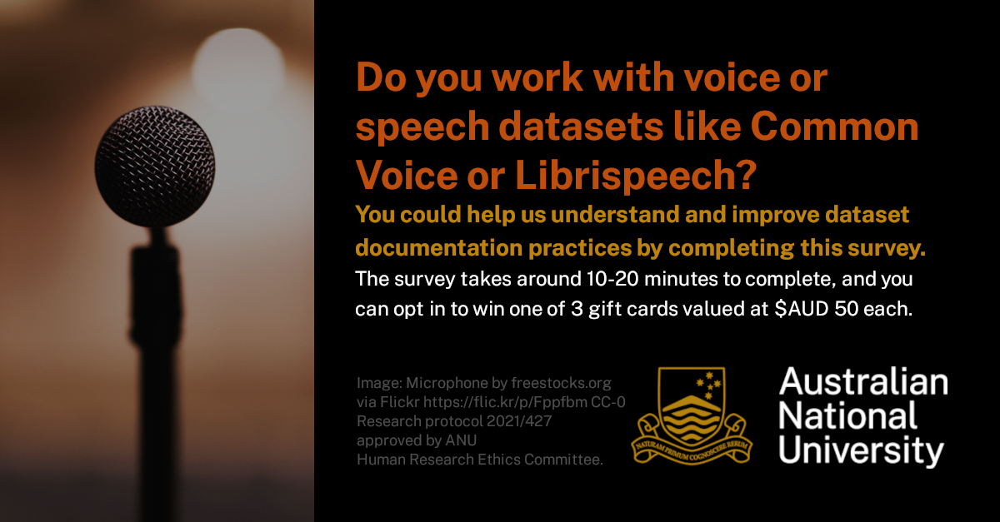

# Hi 👋, I'm Kathy Reid @kathyreid

<h2>Help understand and improve voice dataset documentation practices and make speech technologies work better for more people - and fill out this survey for my PhD research"</h2>

Do you work with #voice or #speech #data? You might contribute data, write data specifications for collection, perform filtering or pre-processing, train #ASR or #TTS models, or design or perform evaluations on #ML speech models. 

If so, I’d love your help to understand current #dataset #documentation practices, and what we can do to make them better as part of my #PhD #research at <a href="https://cybernetics.anu.edu.au">ANU's School of Cybernetics</a>. 

The #survey takes 10-20 minutes to complete, and you can opt in to win one of 3 gift cards valued at $AUD 50 each.

<em>Research Protocol 2021/427 approved by  #ANU Human Research Ethics Committee</em>

<a href=https://anu.au1.qualtrics.com/jfe/form/SV_cSFODa5osYtm96e>Click link to take the survey</a>.

  

---

I'm into open source systems, and I'm a PhD student at the @3AInstitute at Australian National University in Canberra, where I'm looking at voice data and its biases, with a focus on speech technology that works better for more people. I have a Research Partnership with @Mozilla's Common Voice team. 

  

I value;

* :open_hands: **open** sharing of knowledge, code, results.
* :notebook_with_decorative_cover: **non-code contributions** - documentation, project management, governance, "glue" work - are all forms of effort and labour, and should be counted as contributions.
* :fist: :rainbow: **people** irrespective of their skin colour, gender expression, spiritual beliefs, country of origin or antecedent disciplines.

_Together we do better._

  

&nbsp;

## What I'm learning 🌱

* **Machine Learning**: DeepSpeech, Tensorflow, more Python
* **Data Visualisation**: d3.js mostly

## Where you can see my projects 👨‍💻

[https://kathyreid.com.au/portfolio](https://kathyreid.com.au/portfolio)

## Where you can contact me :email:

[https://kathyreid.com.au/contact](https://kathyreid.com.au/contact)

## My latest blog posts from [https://blog.kathyreid.id.au](https://blog.kathyreid.id.au) 📝
<!-- BLOG-POST-LIST:START -->
- [Help me with my PhD research on voice dataset documentation by completing this survey](https://blog.kathyreid.id.au/2023/04/25/phd-research-voice-dataset-documentation/)
- [EverythingOpen: connecting open* communities](https://blog.kathyreid.id.au/2023/04/15/everythingopen-connecting-open-communities/)
- [The Mycroft Mark II and the wind-down of Mycroft AI: it’s all about ecosystems, infrastructures and the friction of privacy](https://blog.kathyreid.id.au/2023/02/19/the-mycroft-mark-ii-and-the-wind-down-of-mycroft-ai-its-all-about-ecosystems-infrastructures-and-the-friction-of-privacy/)
<!-- BLOG-POST-LIST:END -->

## Connect with me

</a>

